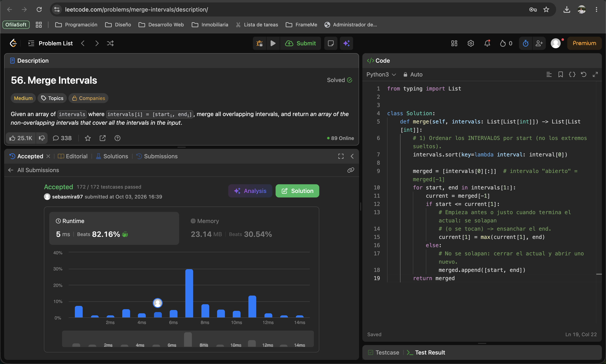
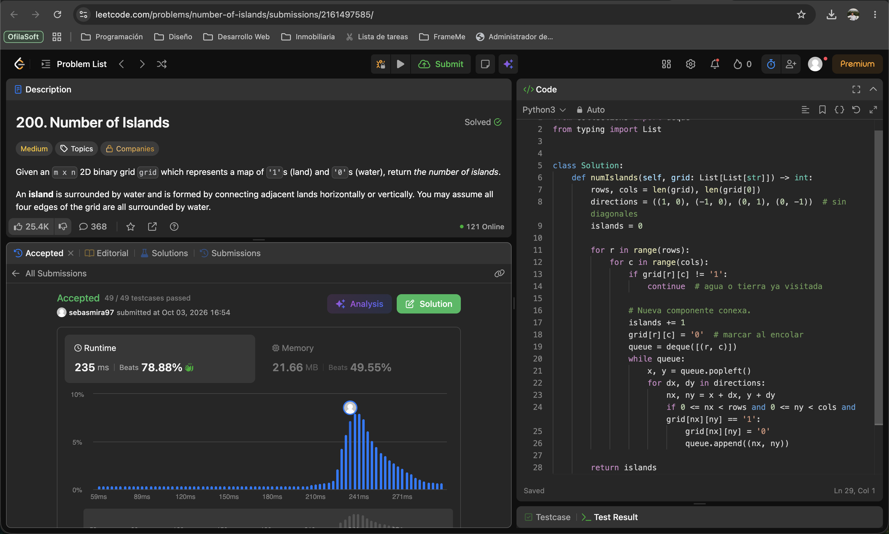
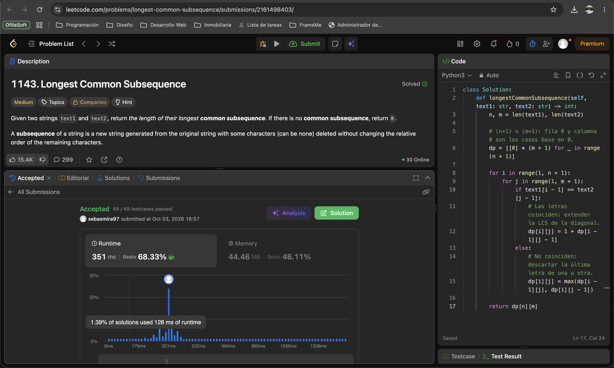
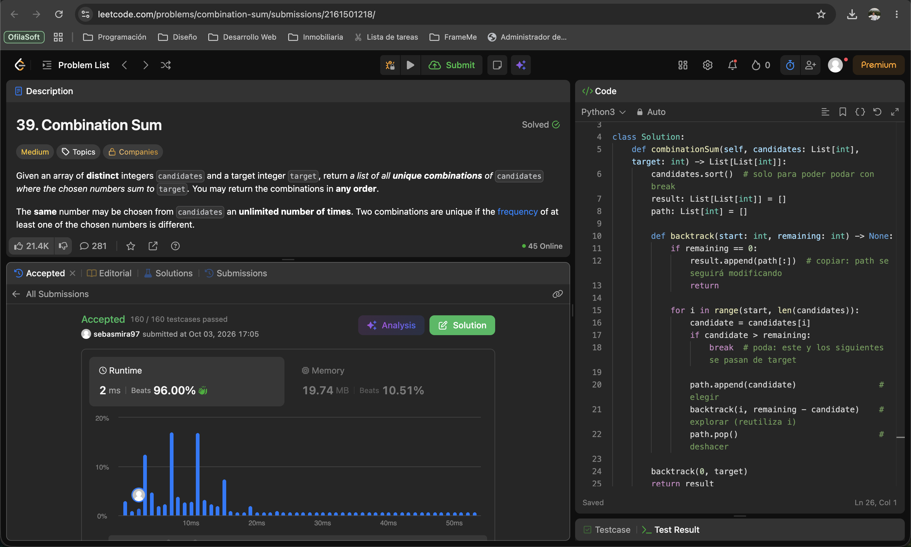

# Taller · Cinco familias en LeetCode

**Curso:** Análisis de algoritmos · ITM · 2026-2  
**Estudiante:** Sebastian Restrepo Mira  
**Usuario LeetCode:** [`sebasmira97`](https://leetcode.com/u/sebasmira97/)  
**Lenguaje:** Python 3

| # | Problema | Familia | Código | Tiempo | Espacio |
| --- | --- | --- | --- | --- | --- |
| 1 | [56. Merge Intervals](https://leetcode.com/problems/merge-intervals/) | Ordenamiento | [solution.py](01-merge-intervals/solution.py) | `O(n log n)` | `O(n)` |
| 2 | [200. Number of Islands](https://leetcode.com/problems/number-of-islands/) | Grafos | [solution.py](02-number-of-islands/solution.py) | `Θ(m·n)` | `O(m·n)` |
| 3 | [1143. Longest Common Subsequence](https://leetcode.com/problems/longest-common-subsequence/) | Programación dinámica | [solution.py](03-longest-common-subsequence/solution.py) | `Θ(n·m)` | `Θ(n·m)` |
| 4 | [435. Non-overlapping Intervals](https://leetcode.com/problems/non-overlapping-intervals/) | Greedy | [solution.py](04-non-overlapping-intervals/solution.py) | `O(n log n)` | `O(1)` extra |
| 5 | [39. Combination Sum](https://leetcode.com/problems/combination-sum/) | Backtracking | [solution.py](05-combination-sum/solution.py) | `O(n^(t/m + 1))` | `O(t/m)` + salida |

---

## 1. [56. Merge Intervals](https://leetcode.com/problems/merge-intervals/)

**Familia:** ordenamiento  
**Idea:** la clave de orden es el `start` de cada intervalo. Tras ordenar los intervalos (no los extremos sueltos), los que se solapan quedan contiguos. Una sola pasada mantiene un intervalo «abierto»: si el siguiente empieza antes o justo cuando termina el abierto, se ensancha su `end`; si no, se cierra y se abre otro. Es el `merge` del laboratorio, pero sobre una sola corrida.  
**Complejidad:** con `n` = número de intervalos, tiempo **`O(n log n)`** (domina el sort; la pasada es `O(n)`) y espacio **`O(n)`** para la salida (más lo que use el sort).

---

## 2. [200. Number of Islands](https://leetcode.com/problems/number-of-islands/)

**Familia:** grafos  
**Modelo:** grafo **no dirigido** implícito en la grilla. Cada celda `'1'` es un **vértice**; hay **arista** entre dos celdas `'1'` vecinas arriba, abajo, izquierda o derecha (no en diagonal). Las celdas `'0'` no son vértices.  
**Idea:** contar islas es contar **componentes conexas**. Se recorre la grilla; cada `'1'` no visitado suma 1 y lanza un BFS que recorre y «hunde» (marca como `'0'`) toda su componente.  
**Complejidad:** con `m` filas y `n` columnas, tiempo **`Θ(m·n)`** (cada celda se encola a lo sumo una vez) y espacio **`O(m·n)`** en el peor caso (la cola del BFS).

---

## 3. [1143. Longest Common Subsequence](https://leetcode.com/problems/longest-common-subsequence/)

**Familia:** programación dinámica (tabla de prefijos)  
**Estado:** `dp[i][j]` = longitud de la LCS de `text1[0..i)` y `text2[0..j)`.  
**Base:** `dp[0][j] = dp[i][0] = 0` (un prefijo vacío no comparte letras).  
**Recurrencia:**

- si `text1[i-1] == text2[j-1]`: `dp[i][j] = 1 + dp[i-1][j-1]` (diagonal + 1);
- si no: `dp[i][j] = max(dp[i-1][j], dp[i][j-1])` (máximo de arriba e izquierda).

**Respuesta:** `dp[n][m]`.  
**Complejidad:** con `n = len(text1)` y `m = len(text2)`, tiempo **`Θ(n·m)`** y espacio **`Θ(n·m)`** (se podría bajar a `Θ(min(n, m))` guardando dos filas).

---

## 4. [435. Non-overlapping Intervals](https://leetcode.com/problems/non-overlapping-intervals/)

**Familia:** greedy (selección de actividades)  
**Criterio greedy:** ordenar por `end`. En cada paso, elegir el intervalo que **termina antes** entre los que no pisan al último aceptado (`start >= lastEnd`; tocarse en un punto no es solape). Lo que no se elige es lo que se borra: respuesta = `n − aceptados`.  
**Por qué es óptimo:** maximizar los intervalos que se quedan equivale a minimizar los que se borran. El que termina antes deja el mayor espacio a la derecha; por intercambio, cualquier óptimo puede cambiar su primer intervalo por ese sin empeorar.  
**Complejidad:** con `n` = número de intervalos, tiempo **`O(n log n)`** (domina el sort) y espacio **`O(1)`** extra (sort in-place).

---

## 5. [39. Combination Sum](https://leetcode.com/problems/combination-sum/)

**Familia:** backtracking  
**Estado:** `(start, remaining, path)`, que son el índice desde el que se puede elegir, lo que falta para `target` y la combinación actual.  
**Qué se elige:** un `candidates[i]` con `i ≥ start`. La llamada recursiva sigue en `i`, así que el número se puede **reutilizar**; nunca se vuelve a índices menores, para no generar permutaciones repetidas.  
**Qué se deshace:** al regresar se hace `path.pop()`, que quita el último elegido, y se prueba el siguiente candidato.  
**Poda:** con `candidates` ordenado, si `candidates[i] > remaining` se corta el ciclo, porque ese candidato y los siguientes se pasan. Si `remaining == 0`, se copia `path` a la respuesta.  
**Complejidad:** con `n = len(candidates)`, `t = target` y `m = min(candidates)`, el árbol tiene profundidad máxima `t/m` y hasta `n` ramas por nivel. El tiempo es **`O(n^(t/m + 1))`** en el peor caso, que es exponencial. El espacio es **`O(t/m)`** de pila y `path`, más la salida.

